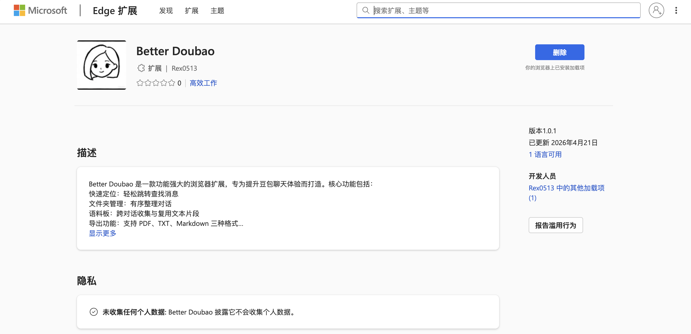
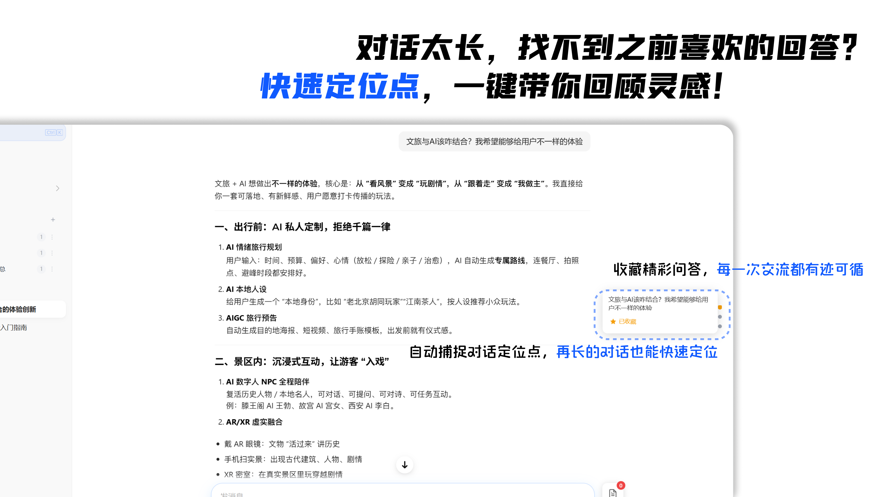
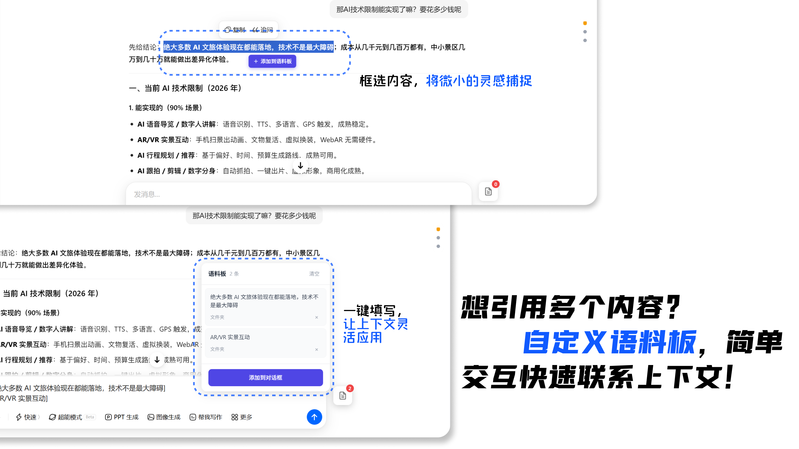
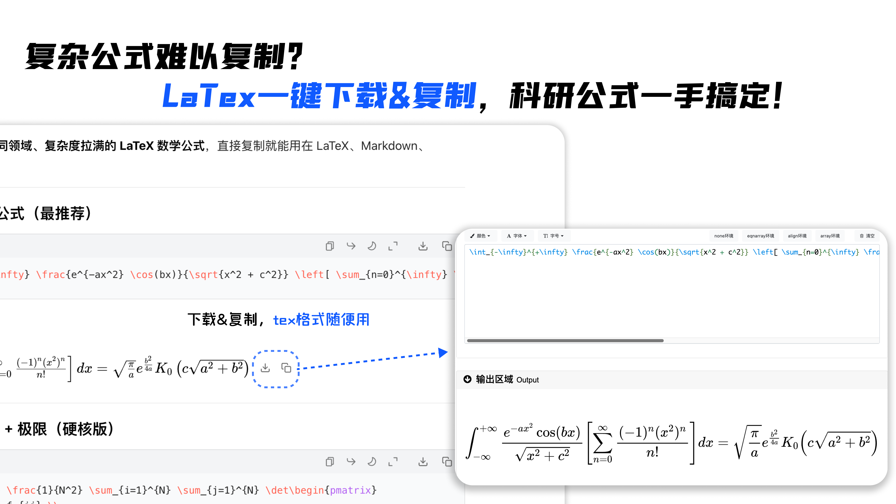
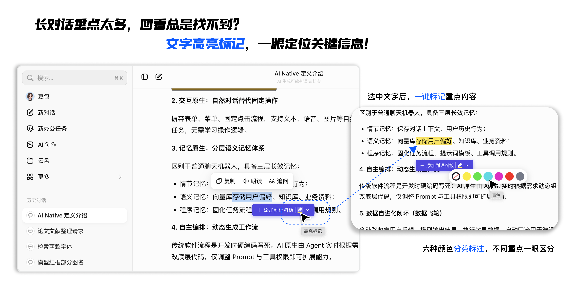

# Better Doubao

> 🔥 灵感来源于 [gemini-voyage](https://github.com/Nagi-ovo/gemini-voyager)，感谢作者的开源贡献！

A powerful browser extension to enhance your Doubao chat experience

## 📢 现已在微软商店成功上线！



**Better Doubao** 已正式在 Microsoft Edge 插件商店上线！您可以直接在商店中搜索并安装插件。

👉 [立即访问 Microsoft Edge 插件商店](https://microsoftedge.microsoft.com/addons/detail/better-doubao/ehkiambnigofgjbodfabknebbmlkblpd?hl=zh-CN)

---

## 功能概述

### 1. 快速定位 (Quick Locator)

快速导航到对话中的任意消息。

**功能特点：**
- 在页面悬浮窗中显示所有消息列表
- 支持收藏重要消息
- 收藏信息持久化存储，跨对话可用
- 点击消息自动滚动定位
- 支持图片、PDF 等纯媒体用户消息

**使用方式：**
- 点击页面左上角的定位图标展开悬浮窗
- 点击消息项快速跳转
- 点击星标图标收藏/取消收藏



---

### 2. 文件夹管理 (Folder Manager)

将对话整理到自定义文件夹中。

**功能特点：**
- 创建彩色标签文件夹
- 拖拽对话到文件夹
- 支持跨对话组织
- 数据持久化存储

**使用方式：**
- 点击侧边栏文件夹图标
- 创建新文件夹并选择颜色
- 拖拽对话到目标文件夹


---

### 3. 语料板 (Corpus Board)

跨对话收集和复用文本片段。

**功能特点：**
- 页面右侧拖拽工具按钮
- 选中文本后显示添加按钮
- 语料持久化存储
- 一键将语料插入输入框（用 `[]` 包围）

**使用方式：**
- 拖拽工具按钮到合适位置
- 选中文本点击「添加到语料板」
- 点击语料板中的项目插入输入框



---

### 4. 导出功能 (Export)

将对话内容导出为多种格式。

**功能特点：**
- 支持 PDF、TXT、Markdown 三种格式
- 正确区分用户/AI 消息
- 支持图片导出（过滤 base64 占位图）
- Markdown 格式完整保留代码块、表格、加粗等样式
- 使用对话标题命名导出文件
- 与豆包原生界面风格一致

**使用方式：**
- 点击顶部导航栏导出按钮
- 选择导出格式
- 自动下载或打开打印预览


---

### 5. LaTeX 公式下载 (LaTeX Downloader)

快速下载或复制页面中的 LaTeX 数学公式。

**功能特点：**
- 自动识别页面中的 LaTeX 公式
- 支持内联公式和块级公式
- 支持 LaTeX 代码块
- 一键下载为 .tex 文件
- 一键复制到剪贴板

**使用方式：**
- 鼠标悬停在公式上，显示下载和复制按钮
- 点击下载按钮下载完整的 .tex 文档
- 点击复制按钮直接复制 LaTeX 代码



---

### 6. 文字高亮标记 (Text Highlight)

在长对话中标记重点内容，方便后续回看和快速定位关键信息。

**功能特点：**
- 选中文本后一键高亮，默认使用荧光黄标记
- 支持黄、绿、青、粉、红、灰六种高亮颜色
- 支持修改已高亮文字的颜色
- 支持取消选中文字的高亮，不影响同一段中的其他标记
- 高亮记录本地持久化保存，不涉及后端
- 切换对话、刷新页面或重新打开浏览器后，高亮仍然保留
- 颜色选择菜单会根据窗口边缘自动调整位置，避免被遮挡

**使用方式：**
- 选中对话中的文字，弹出操作按钮
- 点击荧光笔图标，使用默认黄色高亮
- 点击右侧箭头展开颜色菜单，选择想要的标记颜色
- 选中已高亮内容后，点击空心圆斜线图标取消高亮



---

## 技术架构

### 项目结构

```
better-doubao/
├── src/                        # 共享源代码
│   ├── core/                   # 核心模块
│   │   ├── services/
│   │   │   └── StorageService.ts
│   │   ├── types/
│   │   │   └── folder.ts
│   │   └── index.ts
│   ├── features/               # 功能模块
│   │   ├── quicklocator/       # 快速定位
│   │   ├── folder/            # 文件夹管理
│   │   ├── corpusboard/       # 语料板
│   │   ├── export/            # 导出功能
│   │   └── latex/             # LaTeX 公式下载
│   ├── pages/
│   │   ├── content/            # 内容脚本
│   │   ├── background/        # 后台脚本
│   │   ├── popup/             # 弹出页面
│   │   └── options/           # 设置页面
│   └── assets/
│       └── styles/
│           └── content.css
│
├── chrome/                     # Chrome 版本配置
│   ├── manifest.json          # Chrome 专用清单
│   ├── vite.config.ts        # Chrome 专用构建配置
│   └── dist/                  # Chrome 构建输出 (gitignore)
│
├── edge/                       # Edge 版本配置
│   ├── manifest.json          # Edge 专用清单
│   ├── vite.config.ts        # Edge 专用构建配置
│   └── dist/                  # Edge 构建输出 (gitignore)
│
└── package.json
```

### 技术栈

- **语言**: TypeScript
- **构建工具**: Vite + @crxjs/vite-plugin
- **浏览器 API**: Chrome Extension Manifest V3
- **存储**: chrome.storage.local
- **样式**: 原生 CSS

---

## 安装使用

> ⚠️ **重要提示**：项目同时支持 Chrome 和 Edge，请根据自己的浏览器选择对应的版本构建！

### 使用方法

1. **删除不需要的版本文件夹**：
   - 只用 Chrome？删除 `edge/` 文件夹
   - 只用 Edge？删除 `chrome/` 文件夹

2. **安装依赖并构建**：

```bash
# 安装依赖
npm install

# 构建 Chrome 版本（保留 chrome 文件夹时使用）
npm run build:chrome

# 构建 Edge 版本（保留 edge 文件夹时使用）
npm run build:edge
```

3. **加载扩展**：

**Chrome 用户**：
1. 打开 `chrome://extensions/`
2. 开启「开发者模式」
3. 点击「加载已解压的扩展程序」
4. 选择 `chrome/dist` 目录

**Edge 用户**：
1. 打开 `edge://extensions/`
2. 开启「开发者模式」
3. 点击「加载已解压的扩展程序」
4. 选择 `edge/dist` 目录

---

## 开发命令

```bash
# 开发模式（监听文件变化）
npm run dev

# 构建生产版本（根据保留的文件夹自动选择）
npm run build

# 类型检查
npm run typecheck
```

---

## 许可证

本项目基于 [MIT License](LICENSE) 开源。
